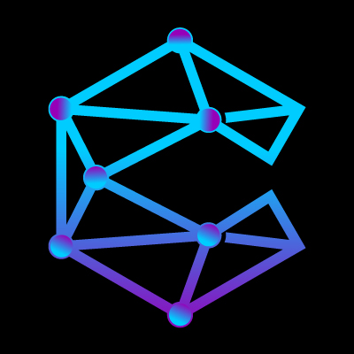

# CipherMind Technologies

🚀 **Empowering Enterprises with Secure, AI-Driven, and Blockchain-Enabled Software Solutions**

[🌐 Visit our Website »](https://ciphermind.tech)

---

## 🏢 About Us

**CipherMind Technologies** is a Pakistan-based software development company focused on delivering cutting-edge solutions in:

- ✅ Artificial Intelligence (AI)
- ✅ Blockchain & Decentralized Applications (DApps)
- ✅ IoT & Real-Time Monitoring Systems
- ✅ ERP Systems & Business Automation
- ✅ Secure Communication & Identity Management

We combine modern tech stacks like `.NET Core`, `React`, `Angular`, `WebRTC`, and `XMPP` to build scalable, enterprise-grade applications tailored to client needs.

---

## 🧠 What We Do

| 🧩 Domain | 💡 Solutions |
|----------|--------------|
| **AI & Computer Vision** | Face recognition, object detection, surveillance analytics |
| **Blockchain Development** | Wallets, transaction explorers, PORC storage, NFT & DAO systems |
| **ERP & Business Systems** | HRM, Accounting, Attendance, Student & Payroll Management |
| **Secure Chat & Video** | XMPP chat, WebRTC calling, group chat, real-time notifications |
| **Real-Time Video Processing** | IP camera streaming, anomaly detection, Arm & Fire detection |

---

## 🛠️ Tech Stack

- **Backend:** ASP.NET Core, Node.js, Python (FastAPI), BigchainDB, Tendermint
- **Frontend:** React, Angular, Tailwind CSS, Bootstrap
- **AI Tools:** TensorFlow, OpenCV, YOLOv8
- **Real-Time:** WebRTC, SignalR, Socket.IO, XMPP
- **DevOps & Infra:** Azure, Docker, GitHub Actions, NGINX
- **Database:** SQL Server, MongoDB, Firebase

---

## 📈 Featured Projects

> 🔒 Detailed project repos are private due to NDA and client confidentiality. Below are brief descriptions.

### 🔹 AI Camera Monitoring (Watch Tower)
Real-time detection via industrial cameras.

### 🔹 **Lernix LMS**
A comprehensive Learning Management System offering student management, teacher coordination, AI-powered analytics, and grading. Includes modules for exams, attendance, classes, and more.

### 🔹 **Food Ordering App**
Mobile-based food ordering system with menu browsing, cart management, and online payments. Supports kitchen-side management, real-time order updates, and customer feedback.

### 🔹 **Parent-Student Management Panel**
Admin panel for educational institutions, allowing parents to track student performance, attendance, results, and communication in real time. Includes multi-role access (admin, teacher, parent, student).

### 🔹 WOO App
NFT, chat, and blockchain-integrated wallet with React + .NET Core backend.

---

## 🤝 Clients & Collaborations

We’ve worked with leading brands and organizations such as:

- International Math Bee (BetterUp5)
- eSheild Game
- Digital Pakistan (Gov Initiative)
- Multiple NGOs, Universities & Enterprises
- Dean & Avior 

---

## 💼 Contact Us

📬 **Email:** contact@ciphermind.tech  
🌐 **Website:** [https://ciphermind.tech](https://ciphermind.tech)  
🔗 **LinkedIn:** [linkedin.com/company/ciphermind/](https://www.linkedin.com/company/ciphermind/)
🔗 **Facebook:** [facebook.com/ciphermindtechnologies](https://www.facebook.com/ciphermindtechnologies)

---

